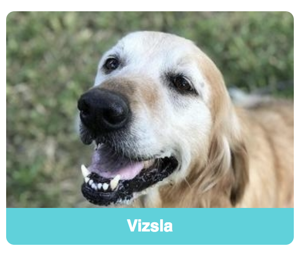

# Card

Provide a flexible container to showcase the content for the correct context.

## Links

- [Bootstrap](https://getbootstrap.com/docs/4.3/components/card)
- [Ant Design](https://ant.design/components/card/)

## Rules

- Built with Flexbox
- Card should have no fixed width or margins, they should fill the parent container
- Support multiple content, images, text, lists, list-groups, links and more
- Use H1 for title make sure in segment and style accordingly

## Horizontal

With a horizontal display the text and action should all be left aligned within
the card content, and the image absolutely positioned to the right hand side.

## Map

## Breed

## Full

